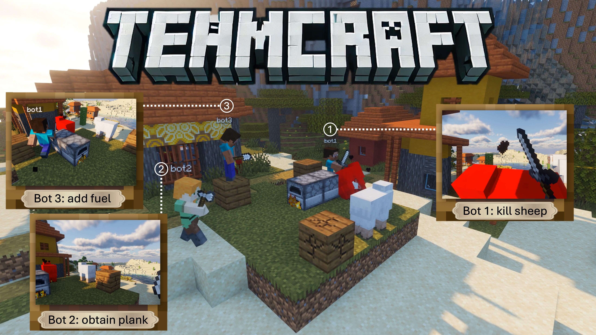

# TeamCraft: A Benchmark for Multi-Modal Multi-Agent Systems in Minecraft

<div align="center">

[](https://github.com/teamcraft-bench/teamcraft)
[](https://github.com/teamcraft-bench/teamcraft/blob/main/LICENSE)
[](https://huggingface.co/datasets/teamcraft/teamcraft_data)
---



</div>

## Release

- [2025/02/13] Publishing TeamCraft [Docker Image](https://hub.docker.com/r/teamcraft/teamcraft-image) on Docker Hub.
- [2025/01/30] Adding [support](https://github.com/teamcraft-bench/teamcraft/blob/main/docs/customize_task.md) for customizing tasks and scenes.
- [2025/12/22] Releasing TeamCraft-VLA ([centralized](https://huggingface.co/teamcraft/TeamCraft-VLA-7B-Cen) and [decentralized](https://huggingface.co/teamcraft/TeamCraft-VLA-7B-Dec)) model checkpoints and training [data](https://huggingface.co/datasets/teamcraft/teamcraft_data). 

In this repo, we provide TeamCraft code. This codebase is under [MIT License](LICENSE).

# Installation

We offer 3 ways to install TeamCraft. Please make sure you have CUDA available on your machine. We have tested on Ubuntu 22.04, CUDA Version 12.4, Nvidia Driver 550.120.

#### *Note: TeamCraft has minimum requirements for hardware, list in [System Requirements](#system-requirements).*

### 1. Conda (Recommended)

#### a. Install Dependencies

Run the following commands to install necessary packages:

```bash
sudo add-apt-repository -y ppa:deadsnakes/ppa
sudo apt-get update

sudo apt-get install -y \
    software-properties-common \
    xvfb \
    xserver-xorg \
    xserver-xephyr \
    libxi-dev \
    libxext-dev \
    ffmpeg \
    openjdk-17-jdk \
    tmux \
    curl \
    build-essential \
    pkg-config \
    libgl1-mesa-dev

# Install Node.js and npm from NodeSource
curl -fsSL https://deb.nodesource.com/setup_20.x | sudo bash -
sudo apt-get install -y nodejs
```

#### b. Create Conda Environment

Create and activate a new Conda environment:

```bash
conda create -n teamcraft -y python=3.9
conda activate teamcraft
```

#### c. Install TeamCraft, LLaVA, and Mineflayer

Navigate to the TeamCraft directory and install the packages:

```bash
cd teamcraft/

python3.9 -m pip install --no-cache-dir -e .
python3.9 -m pip install --no-cache-dir -e ./llava_teamcraft/
python3.9 -m pip install --no-cache-dir -e ./llava_teamcraft/[train]
pip install flash-attn==2.7.3 --no-build-isolation

cd ./teamcraft/env/mineflayer && npm install
```

<details>
    <summary> Installation on Ubuntu 24.04 </summary>

To install on Ubuntu 24.04, change default system gcc and g++ to version 11 before executing **step c** above.

```bash
sudo apt update
sudo apt install gcc-11 g++-11

sudo ln -s -f /usr/bin/gcc-11 /usr/bin/gcc
sudo ln -s -f /usr/bin/g++-11 /usr/bin/g++

# confirm version
g++ --version
gcc --version
```

To change it back:

```bash
sudo ln -s -f /usr/bin/gcc-13 /usr/bin/gcc
sudo ln -s -f /usr/bin/g++-13 /usr/bin/g++
```
</details>

### 2. One-Click Bash Script

Tested on EC2 with Ubuntu Server 22.04 LTS (HVM). Run the setup script with root privileges:

```bash
cd teamcraft/

sudo ./setup.sh
```

### 3. Docker

Install [Docker](https://docs.docker.com/engine/install/) and [NVIDIA Container Toolkit](https://docs.nvidia.com/datacenter/cloud-native/container-toolkit/latest/install-guide.html) on Ubuntu 22.04.

Run [TeamCraft Offical Docker image](https://hub.docker.com/r/teamcraft/teamcraft-image)

```bash
docker pull teamcraft/teamcraft-image:latest
docker run -d --name teamcraft-container --gpus all --ulimit nofile=1000000:1000000 teamcraft/teamcraft-image:latest
```
*Note:*
  - *Xserver is not needed for if using provided Docker image*
  - *Ignore "UserWarning: Subprocess mineflayer failed to start." The mineflayer will restart itself.*

<details>
    <summary>Build Docker image on local machine</summary>

```bash
cd teamcraft/

docker build -t teamcraft-image .
```

Run local image:

```bash
docker run -d --name teamcraft-container --gpus all --ulimit nofile=1000000:1000000 teamcraft-image
```
</details>

# Getting Started

## Inference with our models

**(Optional, For Headless Cloud Desktop Only)** Set up [x server](xserver.py):
```bash
# start tmux session
$ tmux new -s xserver 

# start X server on DISPLAY 0
$ sudo python ./xserver.py 0  # if this throws errors e.g "(EE) Server terminated with error (1)" or "(EE) already running ..." try a display > 0

# detach from tmux shell
# Ctrl+b then d

# set DISPLAY variable to match X server
$ export DISPLAY=:0
```

Run [eval.py](eval.py) for evaluation. It takes the following parameters:

- `--mode`: Evaluation mode; options are `cen` (centralized) and `dec` (decentralized) (default: `cen`)
- `--ckpt`: Local path or huggingface name to the model checkpoint (default: `teamcraft/TeamCraft-VLA-7B-Cen`)
- `--tasks`: Tasks to evaluate; options are `build`, `break`, `farm`, or `smelt` (default: `[build, break, farm, smelt]`)
- `--var_low`: Lowest task variant seed, could be 0 to 249 (default: `0`)
- `--var_high`: One above the largest task variant seed, could be 1 to 250 (default: `1`)
- `--mc_port`: Minecraft server port (default: `2037`)
- `--mineflayer_port`: Mineflayer server port (default: `3000`)
- `--out_folder`: Output folder path, containing evaluation reports and logs (default: `eval_cen/`)
- `--load_4bit`: Whether to load the checkpoint with 4 bit (default: `False`)
- `--load_8bit`: Whether to load the checkpoint with 8 bit (default: `False`)

To run a full evaluation of all 4 tasks (1000 variants total, 250 for each task): 

```bash
# evaluate the 7B centralized checkpoint
python eval.py \
--mode cen \
--ckpt teamcraft/TeamCraft-VLA-7B-Cen \
--tasks build break farm smelt \
--var_low 0 \
--var_high 250 \
--out_folder eval_cen/

# evaluate the 7B decentralized checkpoint
python eval.py \
--mode dec \
--ckpt teamcraft/TeamCraft-VLA-7B-Dec \
--tasks build break farm smelt \
--var_low 0 \
--var_high 250 \
--out_folder eval_dec/
```

To evaluate a specific task `<task_name>`:

```bash
# evaluate the 7B centralized checkpoint
python eval.py \
--mode cen \
--ckpt teamcraft/TeamCraft-VLA-7B-Cen \
--tasks <task_name> \
--var_low 0 \
--var_high 250 \
--out_folder eval_cen/

# evaluate the 7B decentralized checkpoint
python eval.py \
--mode dec \
--ckpt teamcraft/TeamCraft-VLA-7B-Dec \
--tasks <task_name> \
--var_low 0 \
--var_high 250 \
--out_folder eval_dec/
```

To evaluate one variant `<variant_number>` of a specific task `<task_name>`:

```bash
# evaluate the 7B centralized checkpoint
python eval.py \
--mode cen \
--ckpt teamcraft/TeamCraft-VLA-7B-Cen \
--tasks <task_name> \
--var_low <variant_number> \
--var_high <variant_number>+1 \
--out_folder eval_cen/

# evaluate the 7B decentralized checkpoint
python eval.py \
--mode dec \
--ckpt teamcraft/TeamCraft-VLA-7B-Dec \
--tasks <task_name> \
--var_low <variant_number> \
--var_high <variant_number>+1 \
--out_folder eval_dec/
```

Full evaluation with 4 bit: 

```bash
# evaluate the 7B centralized checkpoint
python eval.py \
--mode cen \
--ckpt teamcraft/TeamCraft-VLA-7B-Cen \
--tasks build break farm smelt \
--var_low 0 \
--var_high 250 \
--out_folder eval_cen/ \
--load_4bit True

# evaluate the 7B decentralized checkpoint
python eval.py \
--mode dec \
--ckpt teamcraft/TeamCraft-VLA-7B-Dec \
--tasks build break farm smelt \
--var_low 0 \
--var_high 250 \
--out_folder eval_dec/ \
--load_4bit True
```

## Training

After downloading our [dataset](#downloads), unzip and save it under `./llava_teamcraft/teamcraft_data/`:

```bash
cd llava_teamcraft
mkdir -p teamcraft_data

# Make sure you have git-lfs installed (https://git-lfs.com)
git lfs install

# For centralized data
git clone https://huggingface.co/datasets/teamcraft/TeamCraft-Data-Cen
mv -f TeamCraft-Data-Cen/10001_1_1.png TeamCraft-Data-Cen/combine_centralized_updated.json teamcraft_data/
for zip in TeamCraft-Data-Cen/*.zip; do echo "Extracting $zip..."; unzip -qo "$zip" -d teamcraft_data; done

# For decentralized data
git clone https://huggingface.co/datasets/teamcraft/TeamCraft-Data-Dec
mv -f TeamCraft-Data-Dec/10001_1_1.png TeamCraft-Data-Dec/combine_decentralized_updated.json teamcraft_data/
for zip in TeamCraft-Data-Dec/*.zip; do echo "Extracting $zip..."; unzip -qo "$zip" -d teamcraft_data; done

# Verify saved on correct path 
ls -lh ./teamcraft_data/10001_1_1.png
```

To train, run [finetune_7b_cen.sh](/llava_teamcraft/scripts/v1_5/finetune_7b_cen.sh) and [finetune_7b_dec.sh](/llava_teamcraft/scripts/v1_5/finetune_7b_dec.sh): 

```bash
chmod +x ./scripts/v1_5/finetune_7b_cen.sh
chmod +x ./scripts/v1_5/finetune_7b_dec.sh

# to train centralized 7b model
bash ./scripts/v1_5/finetune_7b_cen.sh

# to train decentralized 7b model
bash ./scripts/v1_5/finetune_7b_dec.sh
```

#### *Note: you may need to modified path and other parameters based on you system configuration*

Training on 8× NVIDIA A100-SXM4-40GB takes ~24 hours for centralized 7B Vicuna model, and takes ~48 hours for decentralized 7B Vicuna model.

# Downloads

We host pretrained models and dataset on [Hugging Face](https://huggingface.co/teamcraft). Download links are listed below. 

*Note: By default, our eval.py will automatically download the pre-trained checkpoints. There is no need to download it manually.*


| Model & Dataset         |                               Hugging Face Link                               |
| ----------------------- | :---------------------------------------------------------------------------: |
| TeamCraft-VLA-7B-Cen    |  [Link](https://huggingface.co/teamcraft/TeamCraft-VLA-7B-Cen)          |
| TeamCraft-VLA-7B-Dec    |  [Link](https://huggingface.co/teamcraft/TeamCraft-VLA-7B-Dec)          |
| TeamCraft-Data-Overview |  [Link](https://huggingface.co/datasets/teamcraft/teamcraft_data)       |
| TeamCraft-Data-Cen      |  [Link](https://huggingface.co/datasets/teamcraft/TeamCraft-Data-Cen)   |
| TeamCraft-Data-Dec      |  [Link](https://huggingface.co/datasets/teamcraft/TeamCraft-Data-Dec)   |


# Documents

For benchmark environment documents, please refer to [environment document](/docs/env_doc.md).

For task design and available evaluation configure setup, please refer to [task document](/docs/task_doc.md).

For how to desin you own task and configuration, please refer to [customize task document](/docs/customize_task.md).


# System Requirements

### Below are our tested configurations for Inference:

PC:

- **CPU**: Intel Core i9-14900KF @3.2 GHz (24 cores, 32 threads)
- **Memory**: 128 GB RAM
- **Disk**: 100 GB available
- **GPU**: 1× NVIDIA RTX A6000 ADA

Workstation:

- **CPU**: AMD Ryzen Threadripper 3990X @2.2 GHz (64 cores, 128 threads)
- **Memory**: 252 GB RAM
- **Disk**: 100 GB available
- **GPU**: 1× NVIDIA RTX A6000

Inference with 4 bit:

- **CPU**: Intel Core i7-12700K @3.6 GHz (12 cores, 20 threads)
- **Memory**: 48 GB RAM
- **Disk**: 100 GB available
- **GPU**: 1× NVIDIA RTX 4070 Super

### We trained our model on:

AWS EC2 Instance:

- **Instance Type**: p4d.24xlarge
- **CPU**: 96 vCPUs @3 GHz
- **Memory**: 1,152 GiB
- **GPU**: 8× NVIDIA A100-SXM4-40GB


# Todo List:
- [x] Add task descriptions in the document
- [x] Add instructions to visualize the game
- [x] Refactor codebase to lower the requirement on CPU cores
- [X] Release task customization instructions and code
- [ ] Enable GPU image rendering 
- [ ] Release the data generation code


